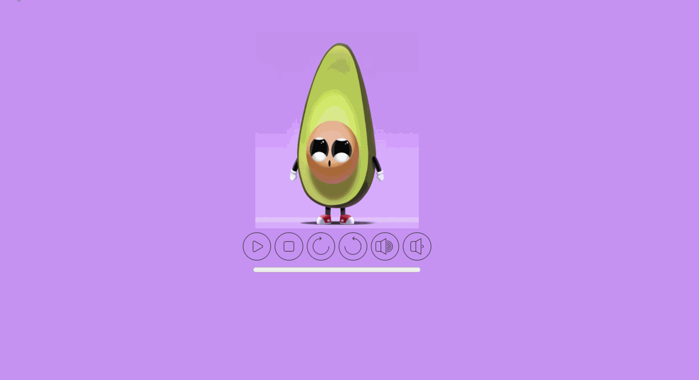
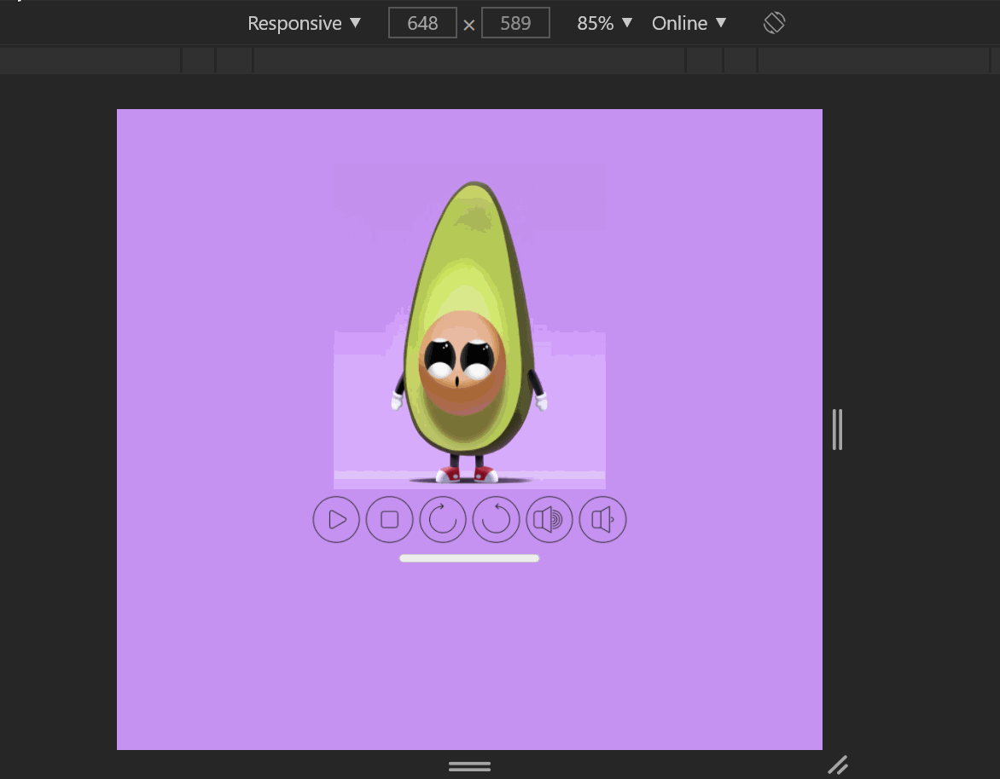

# Reprodutor de Audio

### - Neste projeto desenvolvi um reprodutor de audio customizado de acordo com o solicitado pelo cliente, onde possuo controles de play, pause, stop, acelerar, desacelerar, aumentar volume e abaixar volume. E estes botões possuem interações, que são elas:

#### -Play: Começa e pausa música no mesmo botão.
#### -Stop: Pausa a música e volta o audio para o início do mesmo.
#### -Acelerar áudio: acelera áudio 2x. Se passar de 2x o áudio volta ao normal.
#### -Desacelarar: desacelera áudio 3x. Se passar de 3x o áudio volta ao normal.
#### -Volume: Tanto aumentar volume como abaixar volume possuem limitadores com aviso. 

### - Nesta aplicação foram usados as seguintes tecnologias:

#### *HTML.
#### *CSS.
#### *JavaScript

### Front End para desktop

### Front End para celular

### Acesse o site e veja você mesmo! Link: https://loving-stonebraker-57df44.netlify.app/

### Gostou do meu projeto? :D Entre em contato comigo! 
[Linkedin](https://www.linkedin.com/in/lucas-rosa-058683102/)  
[Email: lucasmetron@gmail.com](mailto:lucasmetron@gmail.com)